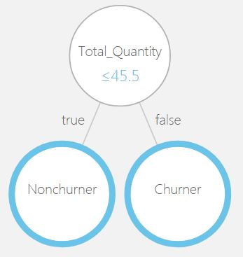
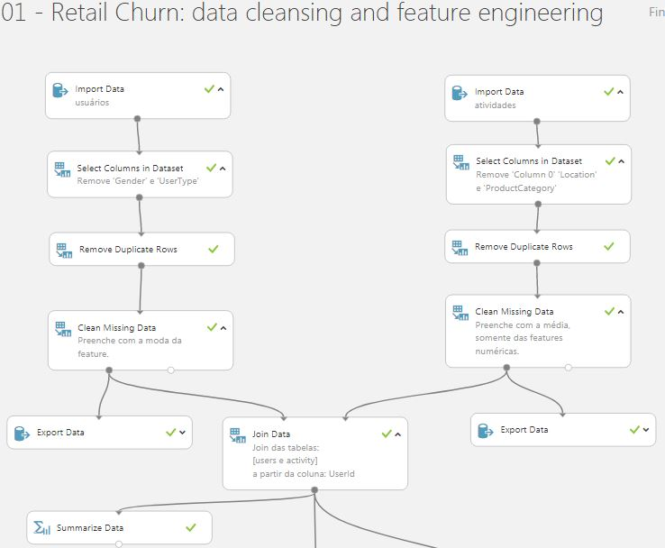
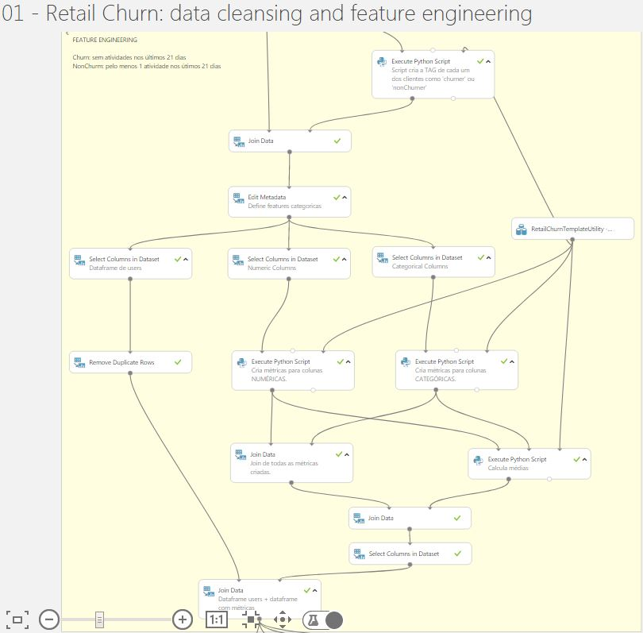
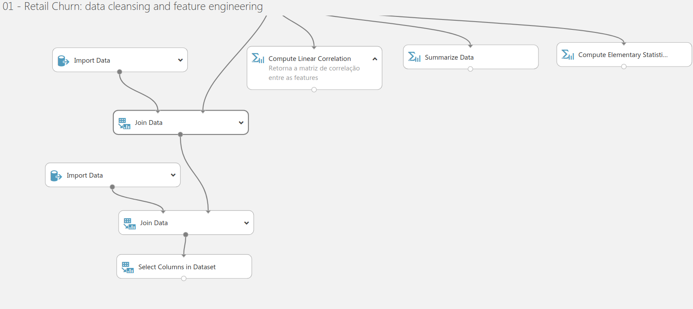
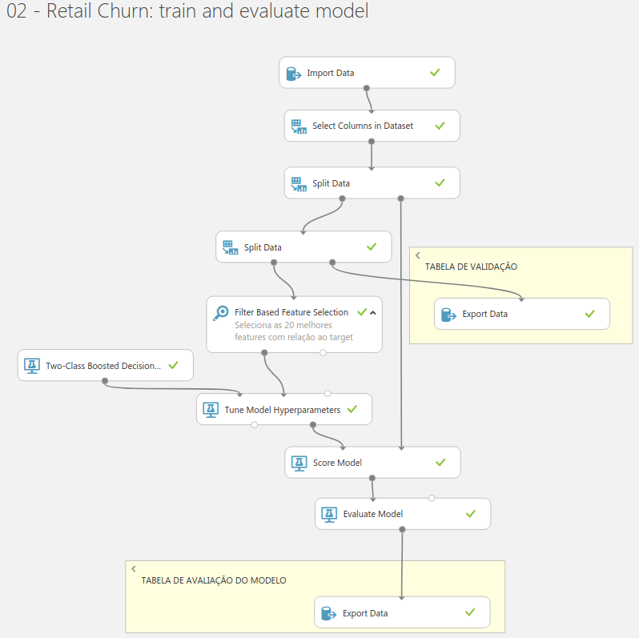
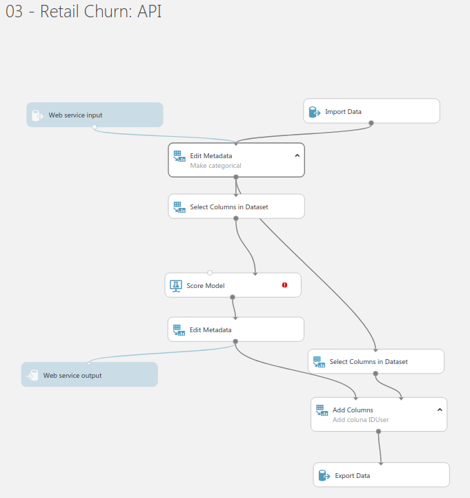

# Challenge: Data Scientist

## Describe Project
Predict retail churn

## Objectives
- Use Microsoft Azure Machine Learning Studio
- Import external librarie in Azure Machine Learning Studio

## Data Source
In this repository: [raw](https://github.com/brunocampos01/predicting-retail-churn-with-azure-ml-studio/tree/master/data/raw)

## Algorithms
Boosted Decision Tree

#### Sample Tree Generated

## Quickstart
- [Step 01 - data cleansing and feature engineering](https://gallery.cortanaintelligence.com/Experiment/01-Retail-Churn-data-cleansing-and-feature-engineering)
- [Step 02 - Train and evaluate](https://gallery.cortanaintelligence.com/Experiment/02-Retail-Churn-train-and-evaluate-model)
- [Step 03 - dashboard](data_visualization/)

## Requirements
This project is tested with:

| Requisite                                         |
|---------------------------------------------------|
| Account in [azure](https://studio.azureml.net/)   |
| Windows 10                                        |
| PowerBI                                           |
| VS code                                           |
| Python 3.5                                        |
| Lib Numpy                                         |
| Lib Pandas                                        |
| Lib azureml-sdk                                   |

## Snapshots

---

---

---

   
	
	
	
	
	

